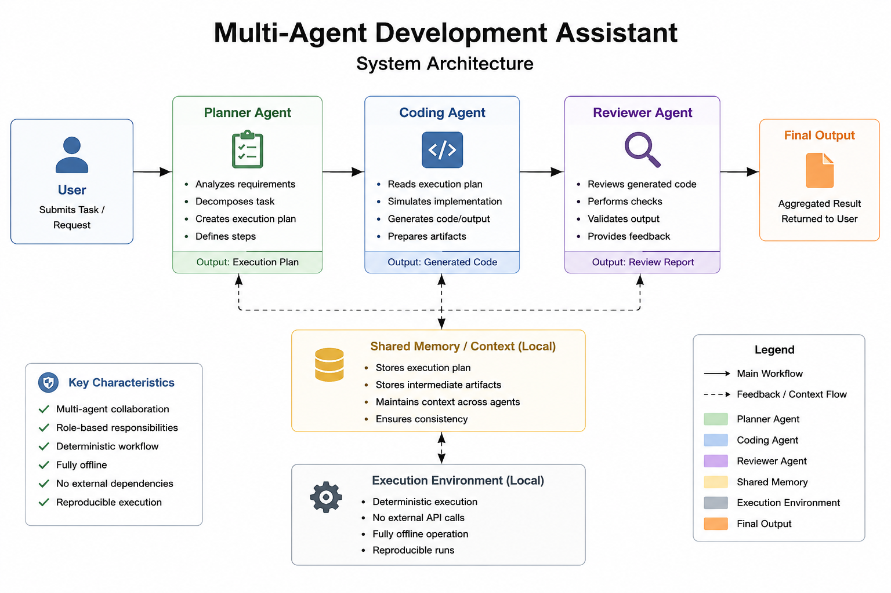
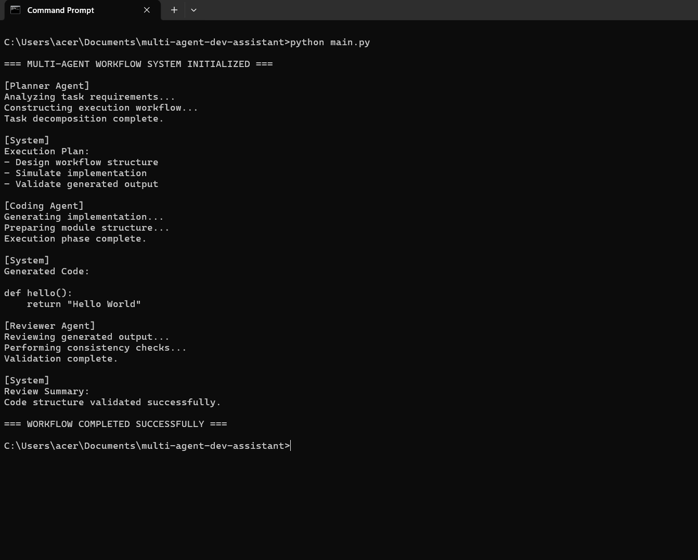

# Multi-Agent Development Assistant

## Overview

A lightweight offline simulation of a multi-agent AI workflow system designed to explore task decomposition, role-based coordination, and reproducible orchestration patterns.

The project models collaborative interactions between specialized agents responsible for planning, implementation, and validation within a deterministic local execution environment.

---

## Features

* Multi-agent workflow simulation
* Deterministic execution pipeline
* Fully offline operation
* No external API dependencies
* Reproducible execution behavior
* Clear separation of agent responsibilities
* Lightweight orchestration architecture
* Modular and extensible workflow design

---

## System Architecture

```text
User Request
      ↓
Planner Agent
(Task Decomposition)
      ↓
Coding Agent
(Implementation Simulation)
      ↓
Reviewer Agent
(Validation & Feedback)
      ↓
Final Output
```
## Architecture Diagram



---

## Workflow

1. User task input is received
2. Planner Agent analyzes and decomposes requirements
3. Coding Agent simulates implementation workflow
4. Reviewer Agent validates generated output
5. Final response is aggregated and returned

---

## Agent Roles

### Planner Agent

Responsible for:

* task decomposition,
* execution planning,
* and workflow coordination.

### Coding Agent

Responsible for:

* simulated implementation,
* structured execution flow,
* and output generation.

### Reviewer Agent

Responsible for:

* validation,
* consistency checks,
* and final workflow review.

---

## Example Output

```text
[Planner Agent]
Analyzing task requirements...
Constructing execution workflow...
Plan created successfully.

[Coding Agent]
Generating implementation...
Preparing module structure...
Execution complete.

[Reviewer Agent]
Reviewing generated output...
Performing consistency checks...
Validation complete.

[System]
Workflow completed successfully.
```

---

## Use Cases

* AI agent workflow simulation
* Educational demonstrations of agentic systems
* Multi-step reasoning experimentation
* Local-first AI workflow testing
* Reproducible orchestration experiments
* Autonomous workflow pipeline prototyping

---

## Project Impact

This project explores how lightweight multi-agent systems can be structured for reproducible AI workflow experimentation without requiring external APIs or cloud infrastructure.

The architecture can serve as a foundation for:

* autonomous workflow experimentation,
* educational AI tooling,
* local-first agent systems,
* scalable orchestration research,
* and agent collaboration studies.

---

## Repository Structure

```text
multi-agent-dev-assistant/
│
├── main.py
├── README.md
├── requirements.txt
├── diagrams/
│   └── architecture.png
├── screenshots/
│   └── execution_output.png
└── docs/
    └── workflow.md
```

---

## Future Improvements

* Shared memory layer between agents
* Persistent execution context
* Parallel agent execution
* Streaming reasoning logs
* Tool invocation framework
* Local LLM integration
* Configurable workflow pipelines
* Autonomous task retry mechanisms

---

## Research Goals

* Explore lightweight orchestration patterns
* Study deterministic multi-agent workflows
* Evaluate reproducible autonomous pipelines
* Investigate local-first AI execution systems
* Experiment with scalable agent coordination

---

## Proof of Execution

The system has been executed locally and demonstrates a full multi-agent workflow pipeline:

Planner Agent → Coding Agent → Reviewer Agent

### Execution Output



---

## Final Summary

This project demonstrates a structured multi-agent workflow architecture operating entirely in a local execution environment. It is designed to explore reproducible orchestration patterns, role-based agent collaboration, and lightweight autonomous workflow experimentation without relying on external AI infrastructure.
